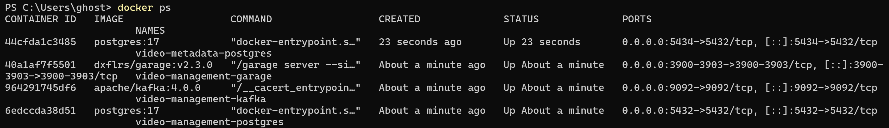
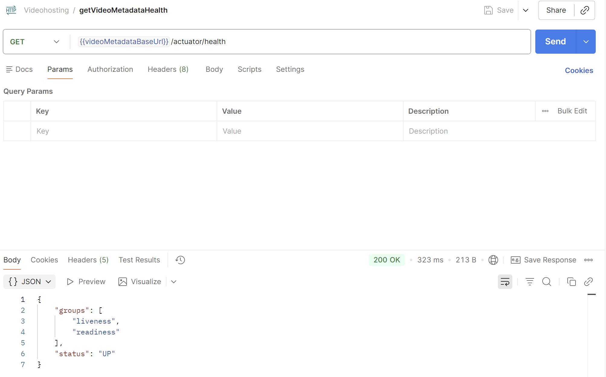
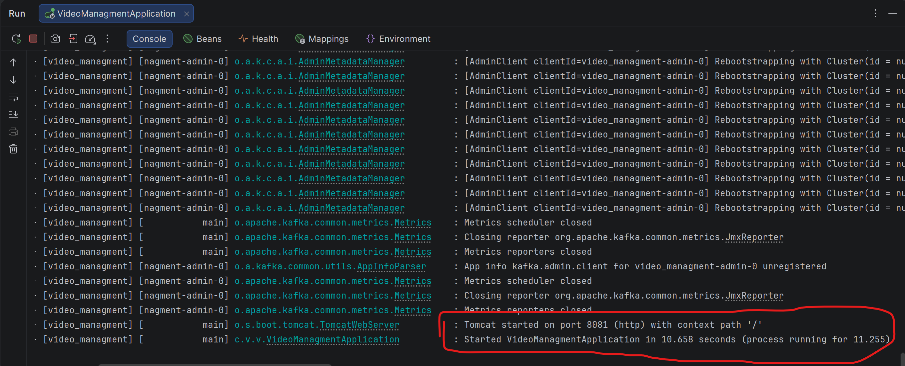

# Проект: video_managment v1.0.1

## 1. Паспорт проекта

**Участники:** Цейтин Андрей Владимирович, avtseytin@edu.hse.ru; Омирбекова Дария, domirbekova@edu.hse.ru  
**Продукт:** `video_managment` - backend-сервис видеохостинговой платформы, который координирует загрузку исходных видеофайлов в S3-совместимое хранилище, хранит технические данные об объектах и публикует событие о завершении загрузки.  
**Планируемый выпуск:** `v1.0.1` - следующая patch-версия после выбранных улучшений и повторной проверки.  
**Исходное состояние:** тег `v1.0.0`, commit `fedf84af687835d023c1d71ee2a8b5bcfc7a1dc5`.  
**Репозиторий:** https://github.com/CehhGhost/videohosting_video_managment

### Контекст и пользователи

`video_managment` является отдельным сервисом учебной видеохостинговой платформы. В границы данной работы входит только этот сервис; остальные компоненты платформы рассматриваются как внешние системы в части их взаимодействия с ним.

Основной пользовательский сценарий - загрузка видео авторизованным пользователем. Сервис получает идентификатор пользователя из JWT, создает метаданные видео через `video_metadata`, создает запись объекта хранения, возвращает временный presigned URL для прямой загрузки файла в Garage, а после подтверждения загрузки проверяет наличие объекта, переводит его из `PENDING_UPLOAD` в `UPLOADED` и публикует событие `video.uploaded` в Kafka.

Внутренние сервисы платформы также могут использовать внутренний API для получения временной ссылки на чтение загруженного видео.

Для пользователей и платформы важны:
- корректная аутентификация и определение владельца видео;
- недоступность пользовательских операций над чужими объектами;
- целостность связи между видео, владельцем и объектом в хранилище;
- ограниченность срока и области действия presigned URL;
- корректность состояния загрузки и события `video.uploaded`.

Решение о готовности выпуска `v1.0.1` принимает команда из двух участников на основании результатов проверок и известных ограничений.

### Границы

**В проект входит:**
- код и конфигурация `video_managment`;
- пользовательский и внутренний REST API;
- проверка JWT и получение `ownerId`;
- проверка принадлежности объекта пользователю;
- сценарии инициализации и подтверждения загрузки;
- создание presigned URL для загрузки и чтения;
- работа с PostgreSQL и Garage;
- REST-взаимодействие с `video_metadata`;
- публикация `video.uploaded` в Kafka;
- тесты, сборка и процесс подготовки выпуска сервиса.

**За пределами проекта:**
- реализация `auth-service`, `video_metadata`, `video_streaming`, orchestrator и сервисов обработки;
- frontend и поисковая подсистема;
- безопасность PostgreSQL, Kafka и Garage как отдельных продуктов;
- production-инфраструктура всей платформы.

Внешние компоненты исследуются только в той части, в которой они образуют интерфейс или границу доверия для `video_managment`.

### Компоненты, взаимодействия и границы доверия

| Компонент | Назначение | Существенная граница |
|---|---|---|
| `VideoStorageController` | Пользовательские операции загрузки и получения данных об объекте | Внешний пользователь -> сервис |
| Spring Security / JWT | Аутентификация и получение пользователя из `sub` JWT | JWT -> доверенный `ownerId` |
| `InternalVideoStorageController` | Получение временной ссылки на чтение видео внутренними сервисами | Внутренний сервис -> внутренний API |
| `VideoStorageService` | Основная бизнес-логика и проверка владельца/статуса | Координация данных между компонентами |
| PostgreSQL | Связь `videoId`, `ownerId`, `objectKey` и статуса | Приложение -> БД |
| Garage | Хранение видео и работа через presigned URL | Приложение/клиент -> объектное хранилище |
| `video_metadata` | Создание метаданных и получение `videoId` | Межсервисный REST |
| Kafka | Передача `video.uploaded` дальнейшим обработчикам | Сервис -> асинхронный pipeline |

Основной поток загрузки:

```text
Пользователь + JWT
        |
        v
video_managment
   |        |
   |        +----> video_metadata
   |
   +-------------> PostgreSQL
   |
   +-------------> Garage -> presigned PUT URL -> Пользователь -> Garage
```

После подтверждения загрузки:

```text
Пользователь -> video_managment -> проверка Garage
                              -> PostgreSQL: UPLOADED
                              -> Kafka: video.uploaded
```

Код и настройки, подтверждающие эти взаимодействия:
- `src/main/java/.../controllers/VideoStorageController.java`
- `src/main/java/.../controllers/InternalVideoStorageController.java`
- `src/main/java/.../services/VideoStorageService.java`
- `src/main/java/.../configs/SecurityConfig.java`
- `src/main/resources/application.properties`
- `docker-compose.yml`

Открытый вопрос для дальнейшего анализа: каким механизмом в целевом окружении ограничивается доступ к внутреннему API `video_managment`.

### Активы и существенные риски

- **Актив:** исходные видеофайлы пользователей.  
  **Что может произойти:** неразрешенное чтение или изменение объекта.  
  **Почему существенно:** нарушаются конфиденциальность и целостность пользовательского контента.

- **Актив:** связь `videoId -> ownerId -> objectKey`.  
  **Что может произойти:** операция выполняется над объектом другого пользователя.  
  **Почему существенно:** эта связь используется для разграничения доступа и выбора физического объекта.

- **Актив:** presigned URL.  
  **Что может произойти:** ссылка попадает к другому субъекту или действует дольше/шире необходимого.  
  **Почему существенно:** после выдачи ссылки обращение к Garage выполняется напрямую, без повторной проверки REST API сервиса.

- **Актив:** состояние загрузки и событие `video.uploaded`.  
  **Что может произойти:** обработка запускается для некорректного объекта либо корректно загруженное видео не передается дальше.  
  **Почему существенно:** событие связывает загрузку с последующим processing pipeline.

### Доступные материалы и ограничения

- [x] исходный код и история изменений;
- [x] возможность собрать и запустить продукт локально;
- [x] зависимости и файлы сборки;
- [x] тесты;
- [x] конфигурации;
- [ ] CI/CD;
- [x] возможность изменить продукт и повторить проверку.

**Доступно:** Git-репозиторий, baseline `v1.0.0`, `pom.xml`, Maven Wrapper, `application.properties`, `docker-compose.yml`, конфигурации Spring Security/JWT, PostgreSQL, Kafka и Garage, существующий тестовый код.

**Недоступно:** production-среда, production-секреты, реальные пользовательские данные и подтвержденные сведения о production-сетевой изоляции.

**Конфиденциальность:** в репозиторий и материалы проекта не помещаются реальные JWT, production-пароли и ключи, персональные данные и реальные пользовательские видео. Для проверок используются тестовые значения и данные.

**Почему проект выполним:** объект ограничен одним сервисом, его код и зависимости доступны команде, локальное окружение воспроизводимо, код и тесты можно изменять, а проверки можно повторить для выпуска `v1.0.1`.

### Воспроизводимый локальный запуск baseline v1.0.0

Для запуска самого приложения нужны PostgreSQL, Garage и Kafka. Для полноценной проверки основного сценария загрузки также запускается `video_metadata`, поскольку `video_managment` обращается к нему при инициализации загрузки.

#### Этап 1. Инфраструктура

В репозитории `video_managment`:

```bash
docker-compose up -d
```

Запускаются:
- PostgreSQL - `localhost:5432`;
- Garage - `localhost:3900`;
- Kafka - `localhost:9092`.

В репозитории `video_metadata`:

```bash
docker-compose up -d
```

Запускается его PostgreSQL - `localhost:5434`.

Проверка:

```bash
docker ps
```

**Свидетельство:**



#### Этап 2. video_metadata

Запуск выполняется через Intelij Idea

Ожидаемый результат - успешный запуск сервиса на `localhost:8084` и успешное выполнения запроса на проверку живости сервиса через Postman.

**Свидетельство:**



#### Этап 3. video_managment

Запуск выполняется через Intelij Idea

Ожидаемый результат - успешный запуск исследуемого сервиса на `localhost:8081` у данного сервиса нет удобного запроса для проверки живости, поэтому предоставляем часть лога запуска< в котором виден успешный запуск.

**Свидетельство:**



Итоговая локальная конфигурация:

```text
PostgreSQL video_managment   localhost:5432
Garage                       localhost:3900
Kafka                        localhost:9092
PostgreSQL video_metadata    localhost:5434
video_metadata               localhost:8084
video_managment              localhost:8081
```

`auth-service` не требуется для старта `video_managment`. Он понадобится только если для функционального запроса необходимо получить JWT обычным способом через пользовательскую аутентификацию платформы.

После запуска baseline `v1.0.0` может использоваться как воспроизводимая исходная точка для анализа, изменений и повторной проверки будущего выпуска `v1.0.1`.
